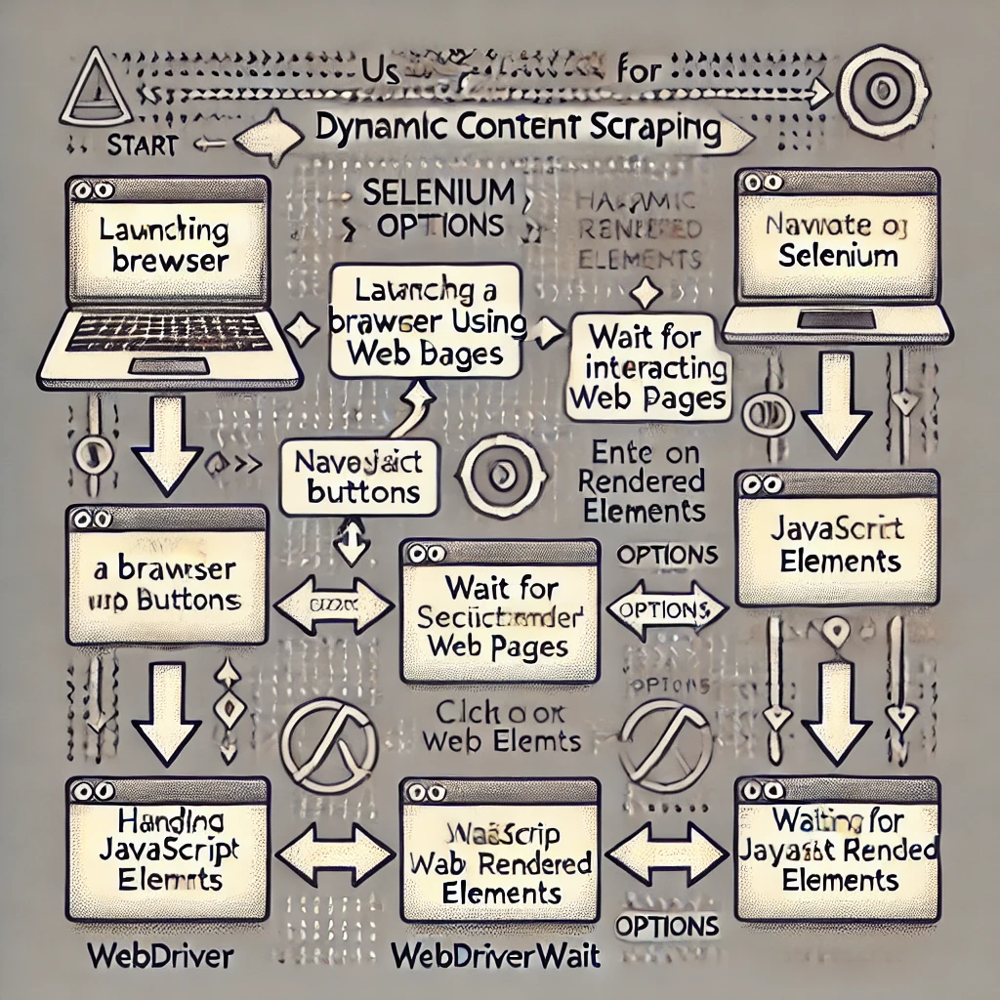

# README

## Purpose
This document serves as an overview of the solution developed for a technical assessment as part of a job application. The task focuses on matching and grouping websites based on the similarity of their logos.

## Task Description
The objective is to identify and cluster websites according to the visual similarities of their logos. Key aspects of the task include:

- **Understanding the Problem:** Before writing code, ensuring alignment with the correct objectives to avoid misalignment and wasted effort.
- **Clustering without ML Algorithms:** Exploring non-ML approaches instead of traditional algorithms like DBSCAN or k-means.
- **Logo Extraction and Matching:** Ensuring accurate logo extraction and effective matching, considering the challenges machines face compared to human perception.
- **Exploring Multiple Angles:** Investigating various perspectives to generate valuable insights.
- **Tech Stack Flexibility:** Using any preferred programming language, tools, or libraries best suited for the task (Veridion has a preference for Node, Python, and Scala).
- **Scalability Consideration:** While not mandatory, designing an approach that has the potential to scale is beneficial.

## General Description
The solution is designed to cluster websites based on the visual similarities of their logos, using a non-machine learning approach. I codded this application in Python. This is a short diagram on the steps I followed: 
<pre>
+--------------------------------+  
|  Logo Extraction               |  
|  (BeautifulSoup & Selenium)    |  
+--------------------------------+
             |
             ▼
+----------------------+  
|  Image Processing    |  
| (Resizing, Noise     |  
|  Reduction, etc.)    |  
+----------------------+
              │
              ▼
+----------------------+  
|  Feature Extraction  |  
| (Keypoints, Hashing) |  
+----------------------+
             │
             ▼
+-------------------------+  
|  Similarity Measurement |  
| (SSIM, Histograms)      |  
+-------------------------+
              │
              ▼
+-------------------------+  
|   Clustering            |  
| (Graph or Heuristic,    |  
| DBSCAN (Density-Based   |  
| Spatial Clustering of   |  
| Applications with Noise)|  
+-------------------------+
           │
           ▼
+---------------------+  
| Scalability &       |  
| Performance         |  
| Optimization        |  
+---------------------+
             │
             ▼ 
+--------------------+  
|  Error Logging     |  
| (Errors stored in  |  
|   log file)        |  
+--------------------+  
</pre>
## Functionality Breakdown

### Extracting the logos

The following diagram will explain how I managed the extraction of logos:
<pre>
+----------------------------------------------------+  
| Function: extract_logo_from_domain(domain)         |  
+----------------------------------------------------+  
        │  
        ▼  
+--------------------------------------+  
| 1. Try Using Requests & BeautifulSoup |  
| - Send HTTP request to domain        |  
| - Parse HTML for <link rel="icon">   |  
| - Parse HTML for  tags          |  
+--------------------------------------+  
        │  
        ├─> If found, return logo URL  
        │  
        ▼  
+-------------------------------------------------+   
| 2. If BeautifulSoup Fails, Use Selenium        |  
| - Set up headless Chrome WebDriver             |  
| - Open the website using HTTPS                 |  
| - Wait for the page to load                    |  
+-------------------------------------------------+  
        │  
        ▼  
+------------------------------------------------+  
| 3. Look for Favicon and Logo Using Selenium    |  
| - Check <link> tags for "icon",                |  
|    "shortcut icon"                             |  
| - Check  tags with class names:           |  
|   "logo", "site-logo", "brand-logo"            |  
+------------------------------------------------+  
        │  
        ▼  
+-------------------------------+  
| 4. Close WebDriver            |  
| - Release resources           |  
+-------------------------------+  
        │  
        ▼  
+-----------------------------------+  
| 5. Return Found Logo or None      |  
| - If favicon found, return it     |  
| - Else, return extracted  src |  
| - Log errors if any occur         |  
+-----------------------------------+  
</pre>

Explanation:

BeautifulSoup4 [https://www.geeksforgeeks.org/beautifulsoup4-module-python/] (*a parser*) is a user-friendly Python library designed for parsing HTML and XML documents. 
However, I ran into an issue when using it alone. Some links for images were not found. I found a couple 
of issues with BeautifulSoup:  
* Parses static HTML content fetched from a webpage, which works well for pages that do not require JavaScript to render their content. However, if the page relies on JavaScript to load or update content dynamically (like loading logos or other images after page load), BeautifulSoup alone can't handle that Struggles with JavaScript-heavy websites because it can't execute scripts. If the website's content is dependent on JavaScript, BeautifulSoup will only show the static HTML content, which might be incomplete.
* Doesn’t interact with browsers at all, so you can’t use headless browser features to automate scraping tasks.  
On the small test sample I used, BeautifulSoup failed to find a logo for many domain names. This is when I started looking for another parser. I found Selenium. *Web scraping* sometimes involves extracting data from dynamic content. Selenium is a multipurpose tool that enables you to interact with a browser and grab the data you require, which is ideal for scraping dynamic content.  

  

Steps to scrap using selenium are presented on the following diagram:  
<pre>
+--------------------------------------------+
|          Launching a Browser with         |
|                Selenium                   |
+--------------------------------------------+
                 |
                 ▼
+--------------------------------------------+
|     Set options for Selenium               |
|     Initialize WebDriver and launch        |
|     the browser                            |
+--------------------------------------------+
                 |
                 ▼
+--------------------------------------------+
|   Navigating and Interacting with Web      |
|                Pages                       |
+--------------------------------------------+
                 |
                 ▼
+--------------------------------------------+
|  Use `driver.get(url)` to load the page    |
|  Find elements with `driver.find_element`  |
|  Interact with elements (click, enter text) |
+--------------------------------------------+
                 |
                 ▼
+--------------------------------------------+
|     Handling JavaScript Rendered          |
|            Elements                       |
+--------------------------------------------+
                 |
                 ▼
+--------------------------------------------+
|  Wait for specific elements to appear      |
|  with WebDriverWait and ExpectedConditions |
|  Interact with elements once visible       |
+--------------------------------------------+

</pre>

